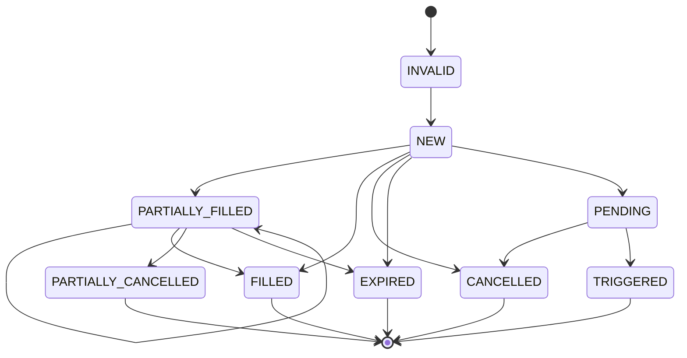
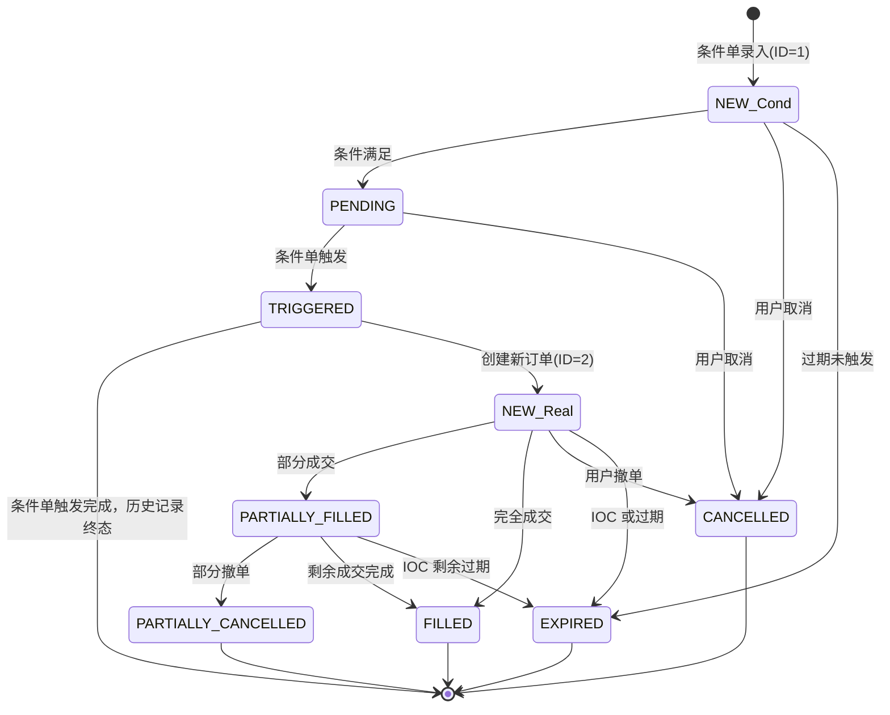

## 订单状态机

```mermaid
stateDiagram-v2
    [*] --> INVALID
    INVALID --> NEW

    NEW --> PARTIALLY_FILLED
    NEW --> FILLED
    NEW --> CANCELLED
    NEW --> EXPIRED
    NEW --> PENDING

    PENDING --> CANCELLED
    PENDING --> TRIGGERED

    PARTIALLY_FILLED --> PARTIALLY_FILLED
    PARTIALLY_FILLED --> FILLED
    PARTIALLY_FILLED --> PARTIALLY_CANCELLED
    PARTIALLY_FILLED --> EXPIRED

    PARTIALLY_CANCELLED --> [*]
    CANCELLED --> [*]
    EXPIRED --> [*]
    FILLED --> [*]
    TRIGGERED --> [*]

```

```mermaid
stateDiagram-v2
    %% 条件单状态
    [*] --> NEW_Cond : 条件单录入(ID=1)
    NEW_Cond --> PENDING : 条件满足
    NEW_Cond --> CANCELLED : 用户取消
    NEW_Cond --> EXPIRED : 过期未触发

    PENDING --> TRIGGERED : 条件单触发
    PENDING --> CANCELLED : 用户取消

    TRIGGERED --> [*] : 条件单触发完成，历史记录终态

    %% 新生成订单状态
    TRIGGERED --> NEW_Real : 创建新订单(ID=2)
    NEW_Real --> PARTIALLY_FILLED : 部分成交
    NEW_Real --> FILLED : 完全成交
    NEW_Real --> CANCELLED : 用户撤单
    NEW_Real --> EXPIRED : IOC 或过期

    PARTIALLY_FILLED --> PARTIALLY_CANCELLED : 部分撤单
    PARTIALLY_FILLED --> FILLED : 剩余成交完成
    PARTIALLY_FILLED --> EXPIRED : IOC 剩余过期

    %% 终态
    CANCELLED --> [*]
    PARTIALLY_CANCELLED --> [*]
    EXPIRED --> [*]
    FILLED --> [*]
```
